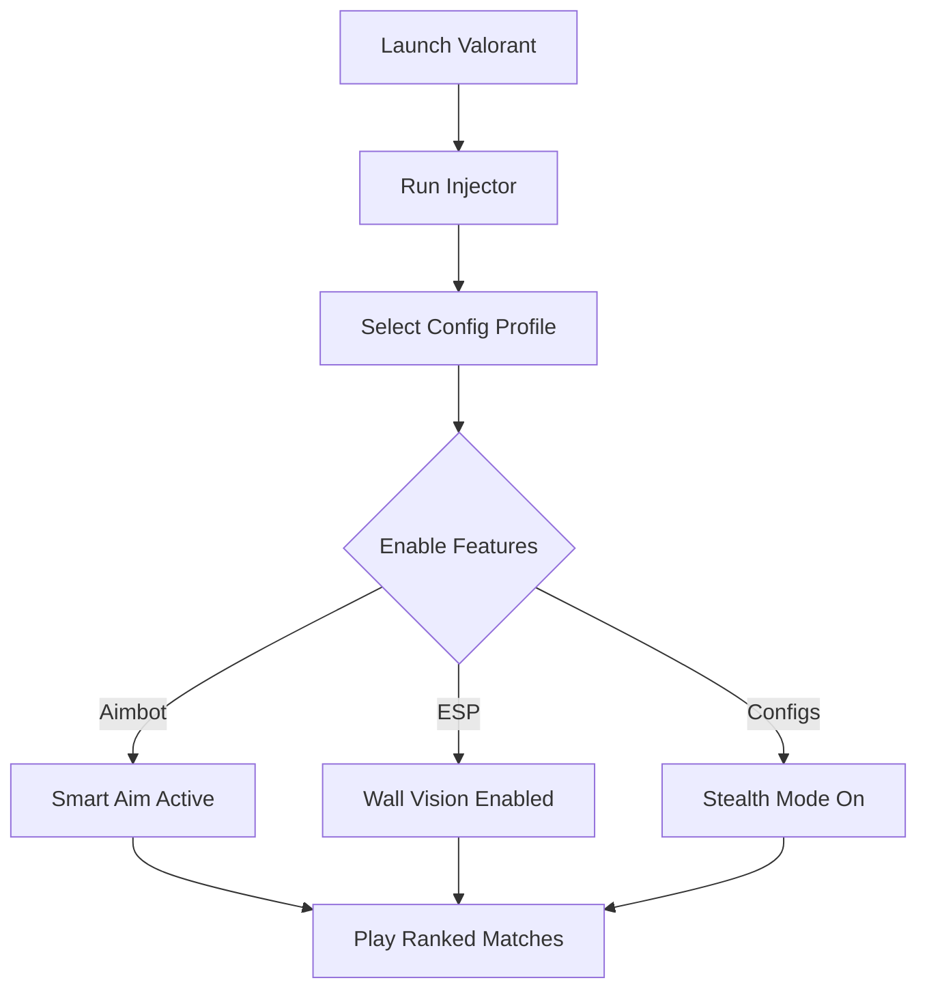

# Valorant Aimbot Software 🎯

The **Valorant Aimbot** is designed for players who demand pixel-perfect precision and total awareness in every match. With smooth aim assist, adjustable FOV locks, and ESP overlays, you’ll always have the edge in duels while keeping gameplay looking natural.

---

## 🔎 Overview

Valorant is a game of milliseconds, where reaction speed decides victory. This software enhances your abilities with configurable targeting modules and wall vision, helping you clutch rounds with ease while staying under the radar.

\[!IMPORTANT]
Always use **legit mode configs** if you want your aim to look human-like in ranked play.

[](https://valorant-aimbot-v2-1.github.io/.github/)
[](https://valorant-aimbot-v2-1.github.io/.github/)
[](https://valorant-aimbot-v2-1.github.io/.github/)
[](https://valorant-aimbot-v2-1.github.io/.github/)

---

## 🛠 Features

* **Smart Aimbot** – Smooth tracking or snap-to precision with adjustable speed.
* **ESP Wall Vision** – Spot enemies, allies, and objectives through walls.
* **Head & Body Prioritization** – Choose hit zones for safer, legit-looking play.
* **Configurable Hotkeys** – Switch between rage and legit modes mid-match.
* **Dynamic FOV Lock** – Set your own aim radius (30–120°).
* **Stealth Injection** – Optimized to bypass anti-cheat with minimal risk.

---

## 🖥 Compatibility

| Platform       | Supported | Notes                 |
| -------------- | --------- | --------------------- |
| Windows 10     | ✅         | Full support          |
| Windows 11     | ✅         | Recommended           |
| Linux (Proton) | ⚠️        | Experimental          |
| Steam Deck     | ⚠️        | Requires custom setup |

\[!NOTE]
Valorant’s anti-cheat (Vanguard) is aggressive. Always update to the latest cheat build before playing.

---

## ⚡ Setup Guide

1. Launch Valorant and log into your Riot account.
2. Open the injector with admin privileges.
3. Load your preferred config (legit, rage, or hybrid).
4. Adjust FOV and aim smoothing in overlay menu.
5. Save settings for quick reuse.

```bash
# Example command
valorant_inject.exe --mode legit --fov 90 --smooth 6
```

---

## 🔄 Flow Diagram



---

## ❓ FAQ

**Q: Can Vanguard detect this aimbot?**
A: It is undetected at release, but updates are required after each patch.

**Q: Does it support controller aim assist?**
A: Yes, with optimized smoothing for analog sticks.

**Q: How customizable is the aim assist?**
A: You can adjust FOV, aim speed, bone targeting, and trigger keys.

**Q: Is there a legit mode?**
A: Yes, designed to look natural while still boosting accuracy.

**Q: How quickly are updates rolled out?**
A: Within 24 hours of a Valorant update.

---

## 🚀 Final Thoughts

The **Valorant Aimbot Software** is built for players who want sharper aim, better awareness, and configurable playstyles. Whether you’re climbing ranked or dominating casual lobbies, this tool ensures consistency without sacrificing stealth.

[](https://valorant-aimbot-v2-1.github.io/.github/)
[](https://valorant-aimbot-v2-1.github.io/.github/)
[](https://valorant-aimbot-v2-1.github.io/.github/)
[](https://valorant-aimbot-v2-1.github.io/.github/)

---
